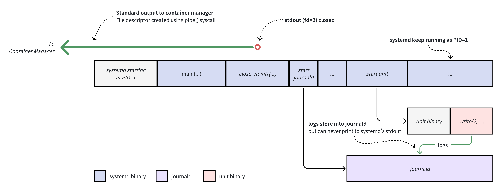
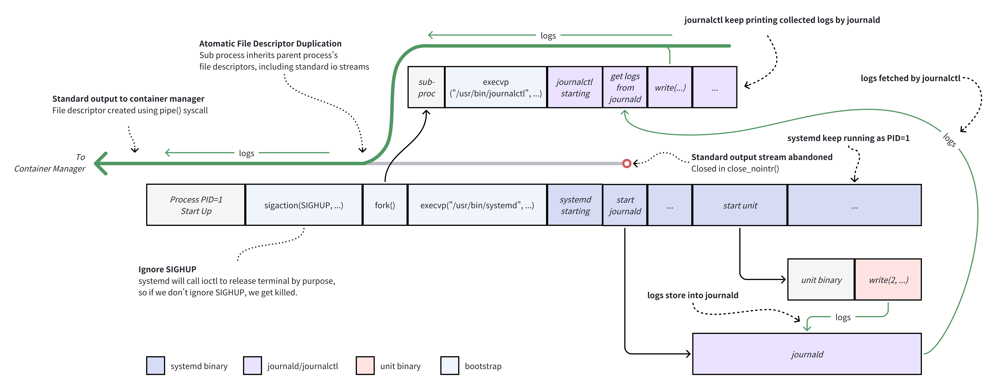
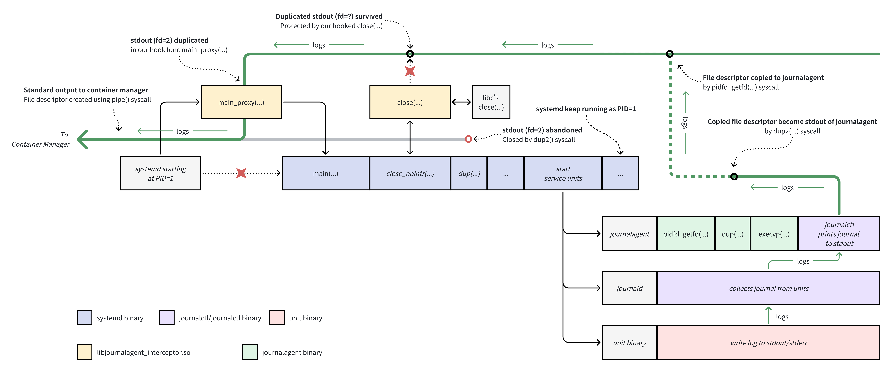

# containering-systemd

containering-systemd is a series of container images that help you to use systemd in container.

The main purpose of writing containering-systemd is to output the logs managed by systemd units to journald and then print them to systemd's standard output. This allows viewing or collecting the logs of container services through `nerdctl container log`.

## Quick Start

Use `vivimice/containering-systemd:debian-12-slim` as your base image, and start the container with `--privileged` flag turned on (which is required by systemd).

```bash
nerdctl run --privileged --rm -it <image>
```

systemd will be run at pid 1 upon container start, then start to print journal in json, which looks like:

```json
{"INVOCATION_ID":"3c2b6c0e6b2243919302a1ca4c7e88ce","SYSLOG_IDENTIFIER":"systemd","CODE_FILE":"src/core/job.c","_MACHINE_ID":"276c1ff3909142adbf5f4dc12d7bbc94","_UID":"0","_SOURCE_REALTIME_TIMESTAMP":"1714447679804730","__MONOTONIC_TIMESTAMP":"5698138892499","CODE_FUNC":"job_emit_done_message","_TRANSPORT":"journal","MESSAGE_ID":"39f53479d3a045ac8e11786248231fbf","_CMDLINE":"/usr/bin/systemd","JOB_RESULT":"done","_SYSTEMD_UNIT":"init.scope","_SYSTEMD_CGROUP":"/init.scope","__CURSOR":"s=784c7d3aed7243adb9a2f5cc526e9453;i=343;b=4c1baa9d6d4d44d5af054b0f017ab0d8;m=52eb38b68d3;t=61747f4f0d53e;x=cd8f19eb19d1cf50","_PID":"1","_SELINUX_CONTEXT":"unconfined\n","SYSLOG_FACILITY":"3","_GID":"0","MESSAGE":"Reached target sysinit.target - System Initialization.","_SYSTEMD_SLICE":"-.slice","_HOSTNAME":"fec3a45b4903","JOB_ID":"4","UNIT":"sysinit.target","_RUNTIME_SCOPE":"system","_BOOT_ID":"4c1baa9d6d4d44d5af054b0f017ab0d8","CODE_LINE":"768","_CAP_EFFECTIVE":"1ffffffffff","PRIORITY":"6","__REALTIME_TIMESTAMP":"1714447679804734","JOB_TYPE":"start","_EXE":"/usr/lib/systemd/systemd","_COMM":"systemd","TID":"1"}
```

Note: If you want to stop the container, always use `nerdctl container stop <container-id>`. Type Ctrl-C in terminal won't work, since systemd ignores SIGINT.

### Use it in your own image

You can use containering-systemd in non-base-image fashion. Just use multi-stage build feature, and use containering-systemd as a build container: 

```Dockerfile
FROM vivimice/containering-systemd:debian-12-slim as contaiering-systemd
```

Then add the following `COPY` instruction to your Dockerfile:

```Dockerfile
# Copy journalagent from containering-systemd image and enable it
COPY --from=contaiering-systemd --chmod=0644 /usr/lib/libjournalagent_interceptor.so          /usr/lib/
COPY --from=contaiering-systemd --chmod=0755 /usr/bin/journalagent /usr/bin/systemd-bootstrap /usr/bin/
COPY --from=contaiering-systemd --chmod=0644 /etc/systemd/system/journalagent.service         /etc/systemd/system/
RUN systemctl enable journalagent

# Define stop signal for systemd
STOPSIGNAL SIGRTMIN+3

ENTRYPOINT [ "/usr/bin/systemd-bootstrap" ]
```

If systemd or journalctl not located under /usr/bin in your image, make sure to create symlinks for them.

```Dockerfile
# systemd-bootstrap script expects systemd and journalctl located under /usr/bin
RUN ln -sf /path/to/systemd/in/your/image /usr/bin/systemd \
    && ln -sf /path/to/journalctl/in/your/image /usr/bin/journalctl
```

Please note that some units may be enabled by default in some distro. It's recommended to mask them since it is not required in a container. 

Take systemd installed in debian-12 for example:

```Dockerfile
# Mask unnecessary units
RUN systemctl mask \
    modprobe@loop.service \
    systemd-modules-load.service \
    systemd-remount-fs.service \
    apt-daily.timer \
    apt-daily-upgrade.timer \
    dpkg-db-backup.timer \
    e2scrub_all.timer \
    e2scrub_reap.service \
    console-getty.service \
    getty@tty1.service \
    systemd-logind.service
```

See [Example usage on fedora:40 base image](examples/own-base-image/Dockerfile).

# Necessity

It is well-known that container managers collect logs from main process's stdout and stderr. But this is broken in systemd managed containers, because of who doesn't print journals to its stdout.

> systemd do accept an option in unit configuration (`StandardOutput`/`StandardError`), which can redirect the unit's stdout/stderr to the tty (`journal+console`). However, this feature is not applicable when a container, such as the ones running in Kubernetes, does not have a tty connected.

Notably, systemd does not forward its stdout/stderr file descriptor to any unit process; instead, it closes any file descriptors (fds) passed to it early in its main() function. Thus, the stdout/stderr file descriptor, being one end of the pipe() call created by a container manager, becomes inaccessible for printing after it has been closed.

The following diagram illustrated the execution procedure of systemd in a container:



So, in the past days, the only way to get logs out of a systemd managed container, is to mount its /var/log/journal directory to the host, followed by using journalctl for inspection. However, this approach increases deployment complexity and does not conform to the conventional container log management facilities.

# Possible workaround

One might wonder: what if we craft a custom program (bootstrap) and run it as the main process, fork() a sub-process, in which we exec() journalctl later, then replace main process with systemd using exec()? So that journalctl inherits the stdout/stderr, and [systemd "inherits" pid 1](https://developers.redhat.com/blog/2016/09/13/running-systemd-in-a-non-privileged-container), everyone is happy.

The following diagram illustrates this idea:



This workaround works most of the time, but there is one pitfall: the unintentional exit of journalctl process.

In this workaround, journalctl process more like systemd's sibling, rather than as a child process. If journalctl unexpectedly exits (due to an out-of-memory killer, accidental termination by another process inside the container, or a bug in journalctl itself, although this is least likely) it would result in a permanent halt of the log output. That's because the only file descriptor, which write logs to the container manager, will be closed upon the exit of journalctl.

This risk factor makes this workaround unsuitable for production environments.

# How does containering-systemd work ?

containering-systemd solved the problem by saving the stdout/stderr file descriptor from closing in systemd, and reconnect it to journalctl in a service unit:

1. systemd is started as main process with `LD_PRELOAD` pointing to our _libjournalagent-interceptor.so_.
2. In _libjournalagent-interceptor.so_, a code snippet is called prior to the actual main function of systemd. The code snippet duplicates stdout by calling `dup()`, then record the returning fd both in memory and environment variable `SYSTEMD_STDOUT_FILENO`.
3. During the initialization of systemd, `collect_fds()` discovers all opening fds, including our duplicated one, and then pass it to `close(int)`. But _libjournalagent-interceptor.so_ had hooked this libc function, and ignores if the argument matches the value we'd stored in the previous step.
4. After systemd successfully initialized, it will start a special service unit named `journalagent`, and pass `SYSTEMD_STDOUT_FILENO` (instructed by `PassEnvironment=` directive in _journalagent.service_).
5. _journalagent_ service uses `pidfd_getfd` syscall in Linux to copy the duplicated file descriptor from systemd, call `dup2` to wire it as its own stdout, and then fork/exec journalctl
6. journalctl now write everything to systemd's stdout.

The following diagram provides a visual representation of this concept:



Now, in this solution, journalctl is fully managed by systemd. So we can ensure that log output will not be terminated by configuring `Restart=` directive in `journalagent.service`. Once journalctl is terminated unexpectedly, systemd can restart it, and journalctl can restart and regain the stdout's file descriptor, which is stored safely in systemd's process.

# Future work

In the current solution, some logs might be lost during the small time slice between journalctl restarts. We can update journalagent to record some identity of the last successful output log on disk (or more effeciently, in systemd's file descriptor store), so we can resume from where we stopped earlier.

# Note

Tested:

- containerd (v1.7.6) on Debian 12.5
- Docker Engine (v24.0.6) on Windows Wsl 2 (Ubuntu Jammy)

# References

- https://developers.redhat.com/blog/2019/04/24/how-to-run-systemd-in-a-container
- https://developers.redhat.com/blog/2016/09/13/running-systemd-in-a-non-privileged-container
- https://systemd.io/CONTAINER_INTERFACE/
